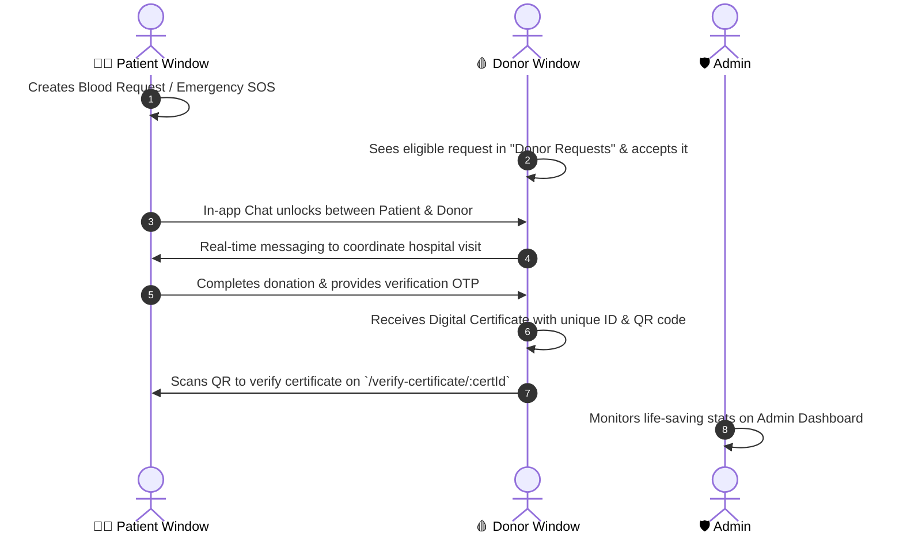

# 🩸 LifeLink — Next-Gen Blood Donation Platform

<p align="center">
  
  
  
</p>

<p align="center">
  <strong>An end-to-end blood donation lifecycle platform connecting patients in urgent need with eligible life-saving donors through real-time matching, in-app chat, OTP-verified donations, and QR-verifiable certificates.</strong>
</p>

<p align="center">
  <a href="#-interactive-demo--testing-guide-for-reviewers">🎮 Testing Guide</a> •
  <a href="#-key-features">✨ Key Features</a> •
  <a href="#-workflow-architecture">🔄 Workflow</a> •
  <a href="#-tech-stack">🛠️ Tech Stack</a> •
  <a href="#-quick-start">🚀 Quick Start</a> •
  <a href="#-api-reference">📡 API Reference</a> •
  <a href="#-author">👩‍💻 Author</a>
</p>

---

## 🎮 Interactive Demo & Testing Guide (For Reviewers)

> [!TIP]
> **Visiting the Live Deployment on Vercel / Cloud?**  
> To test all multi-user features (Requesting -> Accepting -> Real-Time Chat -> Certificate Generation -> Admin Controls) without creating fresh accounts from scratch, follow the 3-minute evaluation walkthrough below!

### 🔑 Recommended Demo Roles

| Role | Suggested Email | Password | Primary Capabilities to Test |
| :--- | :--- | :--- | :--- |
| **🩸 Blood Donor** | `donor@demo.com` | `donor123` | View nearby requests, accept blood requests, real-time chat with patient, download verified certificates, manage availability & reward points. |
| **🧑‍⚕️ Patient / Recipient** | `patient@demo.com` | `patient123` | Post regular & Emergency SOS blood requests, track real-time fulfillment status, chat with donor, verify donation via OTP. |
| **🛡️ Administrator** | `admin@demo.com` | `admin123` | Inspect complete platform analytics, moderate all blood requests, view registered donors/patients, manage system records. |

*(Note: If testing on an unseeded fresh database, simply register two accounts with the "Blood Donor" and "Patient" roles in 30 seconds).*

---

### ⏱️ 3-Minute End-to-End Walkthrough

To experience the complete LifeLink pipeline, open **two browser windows** (or one normal window and one **Incognito window**):



1. **Step 1: Patient posts a request**  
   - Login as **Patient** in Window 1.
   - Go to **Request Blood** (`/request-blood`), fill in hospital details, blood group (e.g. `O+`), city, and urgency (Normal / Urgent / Emergency SOS).
   - The request is saved and broadcasted to eligible donors.

2. **Step 2: Donor discovers & accepts request**  
   - Login as **Donor** in Window 2 (Incognito).
   - Go to **Donor Requests** (`/donor-requests`). Filter by city/blood group.
   - Click **Accept Request** on the newly created request.

3. **Step 3: In-App Chat & Coordination**  
   - The **Chat Modal / Chat Room** (`/chat/:requestId`) opens up between the donor and patient.
   - Exchange messages to coordinate the blood bank / hospital meeting in real-time.

4. **Step 4: Donation Completion & Digital Certificate**  
   - Once fulfilled, complete the donation with OTP verification.
   - The donor earns **LifeLink Reward Points** and receives an official **Certificate of Appreciation**.
   - Download the high-res certificate as a **PDF/Image** (generated client-side via `html2canvas` & `jspdf`).
   - Open `/verify-certificate/:certId` or scan the generated **QR Code** to verify authenticity!

5. **Step 5: Admin Oversight**  
   - Access `/admin` to inspect system health, manage all requests, and review donor distributions.

---

## ✨ Key Features

### 🩸 Core Blood Coordination
- **Instant Donor Discovery:** Search and filter available donors by blood group (`A+`, `A-`, `B+`, `B-`, `O+`, `O-`, `AB+`, `AB-`) and location/city.
- **Urgency & Emergency SOS:** Color-coded urgency levels (`Normal`, `Urgent`, `Emergency SOS`) for prioritizing critical intensive-care needs.
- **Availability Toggle:** Donors can switch status between `Available`, `Temporarily Unavailable`, and `Not Available`.

### 💬 Real-Time In-App Chat
- Dedicated request-specific chat channels linking matched donors directly to patients.
- Keeps private contact info secure while enabling seamless hospital coordination.

### 📜 Automated Verifiable Certificates
- **Dynamic PDF/Image Generation:** Instant certificate generation for donors upon successful donation.
- **Cryptographic / Unique QR Verification:** Built-in QR codes linking to `/verify-certificate/:certId` to authenticate legitimate donations for academic/work recognition.
- **Gamified Rewards:** Donors earn points and milestone recognition for repeated blood donations.

### 🛡️ Administrative Command Center
- Role-protected routes (`AdminRoute`).
- Visual overview of pending, accepted, rejected, and fulfilled requests.
- User management and platform auditing.

### 🎨 Modern & Accessible UI
- Built with **React 19**, **Vite**, and **Tailwind CSS v4**.
- Full **Dark Mode / Light Mode** theme switching with persistent user preference.
- Animated dynamic impact statistics using `react-countup`.
- Fully responsive across mobile, tablet, and desktop screens.

---

## 🛠️ Tech Stack

| Domain | Technology / Library | Purpose |
| :--- | :--- | :--- |
| **Frontend Framework** | React 19 + Vite 8 | Ultra-fast client-side rendering & optimized bundling |
| **Styling & Design** | Tailwind CSS v4, React Icons | Modern responsive design with glassmorphism & dark mode |
| **Routing** | React Router DOM v7 | Client-side routing, protected routes & URL parameter matching |
| **Certificate Engine** | html2canvas, jsPDF, qrcode.react | Client-side vector certificate rendering & QR verification |
| **Backend Runtime** | Node.js + Express.js 5 | Scalable RESTful API architecture |
| **Database & ODM** | MongoDB Atlas + Mongoose 8 | Document-oriented storage, schema validation & population |
| **Authentication** | JWT (JSON Web Tokens) + bcrypt | Secure stateless authentication and hashed passwords |
| **HTTP Client** | Axios | Intercepted API calls with authorization bearer token passing |

---

## 🏗️ Architecture & Data Flow

```text
       ┌────────────────────────────────────────────────────────┐
       │                   LifeLink Client UI                  │
       │  (React 19, Tailwind CSS v4, Context API, Theme engine) │
       └───────────────────────────┬────────────────────────────┘
                                   │  HTTP Requests (Axios + JWT)
                                   ▼
       ┌────────────────────────────────────────────────────────┐
       │                  Express 5 REST API                    │
       │  - authMiddleware (JWT verification)                   │
       │  - adminMiddleware (Role authorization)                │
       └───────────────────────────┬────────────────────────────┘
                                   │  Mongoose ODM
                                   ▼
       ┌────────────────────────────────────────────────────────┐
       │                     MongoDB Atlas                      │
       │  - Users (Donors, Patients, Admins)                    │
       │  - BloodRequests (Status, Urgency, Verification OTP)   │
       │  - Messages (Donor-Patient chat logs)                  │
       │  - Certificates (Unique CertId, QR metadata)           │
       │  - Notifications                                       │
       └────────────────────────────────────────────────────────┘
```

---

## 📁 Project Structure

```text
LIFELINK-Blood-Donation-Platform/
├── Backend/
│   ├── middleware/
│   │   ├── adminMiddleware.js       # Admin role validation
│   │   └── authMiddleware.js        # JWT token extraction & verification
│   ├── models/
│   │   ├── Certificate.js           # Certificate schema & unique certId
│   │   ├── Message.js               # In-app chat messages
│   │   ├── Notification.js          # Activity notifications
│   │   ├── Request.js               # Blood request & OTP verification
│   │   └── User.js                  # Donor/Patient/Admin model & bcrypt hook
│   ├── server.js                    # Express app, routes & controllers
│   ├── package.json
│   └── .env.example
├── frontend/
│   ├── src/
│   │   ├── assets/                  # Illustrations & brand assets
│   │   ├── components/              # Shared UI components, Navbar, Footer, Modals
│   │   ├── context/                 # ThemeContext (Dark/Light mode)
│   │   ├── pages/
│   │   │   ├── Home.jsx             # Landing page with live impact counter
│   │   │   ├── FindDonor.jsx        # Search donors by blood group & city
│   │   │   ├── RequestBlood.jsx     # Submit emergency & regular requests
│   │   │   ├── DonorRequests.jsx    # Donor portal to accept requests
│   │   │   ├── ChatPage.jsx         # Real-time coordination room
│   │   │   ├── Dashboard.jsx        # User profile, history & rewards
│   │   │   ├── AdminDashboard.jsx   # Admin statistics & moderation
│   │   │   └── VerifyCertificate/   # Public QR verification route
│   │   ├── services/
│   │   │   └── api.js               # Axios instance with baseUrl & auth interceptor
│   │   ├── App.jsx                  # Master route configuration
│   │   └── main.jsx
│   ├── package.json
│   └── vite.config.js
└── README.md
```

---

## 🚀 Quick Start (Local Setup)

### Prerequisites
- [Node.js](https://nodejs.org/) (v18.0.0 or higher)
- [Git](https://git-scm.com/)
- A free [MongoDB Atlas](https://www.mongodb.com/cloud/atlas) cluster connection string

### 1. Clone the repository
```bash
git clone https://github.com/Ayushishukla340/LIFELINK-Blood-Donation-Platform.git
cd LIFELINK-Blood-Donation-Platform
```

### 2. Configure Backend
```bash
cd Backend
npm install
```

Create a `.env` file in the `Backend/` directory:
```env
PORT=5000
MONGO_URI=mongodb+srv://<username>:<password>@cluster.mongodb.net/lifelink?retryWrites=true&w=majority
JWT_SECRET=your_super_secret_jwt_key_here
```

Start the backend API server:
```bash
npm run dev
# Server runs at http://localhost:5000
```

### 3. Configure Frontend
Open a new terminal window:
```bash
cd frontend
npm install
npm run dev
# Client runs at http://localhost:5173
```

---

## 📡 Key API Endpoints

### 🔐 Authentication
- `POST /api/register` — Register a new user (`Blood Donor`, `Patient`, `Admin`)
- `POST /api/login` — Authenticate and receive signed JWT token
- `GET /api/me` — Retrieve logged-in profile data

### 🩸 Blood Requests & Matching
- `POST /api/requests` — Create a new blood request (Patient)
- `GET /api/requests` — Fetch requests (filterable by city & blood group)
- `PUT /api/requests/:id/accept` — Accept request (Donor)
- `POST /api/requests/:id/verify-otp` — Verify donation completion via OTP

### 💬 Messaging & Chat
- `GET /api/chat/:requestId` — Retrieve conversation history for a matched request
- `POST /api/chat/:requestId` — Send a message in request room

### 📜 Certificates & Verification
- `GET /api/certificates/my-certificates` — Retrieve donor certificates
- `GET /api/certificates/verify/:certId` — Public lookup to verify certificate authenticity

### 🛡️ Administration
- `GET /api/admin/stats` — Platform-wide aggregation metrics
- `GET /api/admin/users` — User audit & moderation
- `PUT /api/admin/requests/:id/status` — Modify request state

---

## 👩‍💻 Author

**Ayushi Shukla**  
*B.Tech in Computer Science and Engineering (Artificial Intelligence)*  
*Babu Banarasi Das University, Lucknow*  

- **GitHub:** [@Ayushishukla340](https://github.com/Ayushishukla340)

---

<p align="center">
  Made with ❤️ to bridge the gap between blood donors and lives in need.
</p>